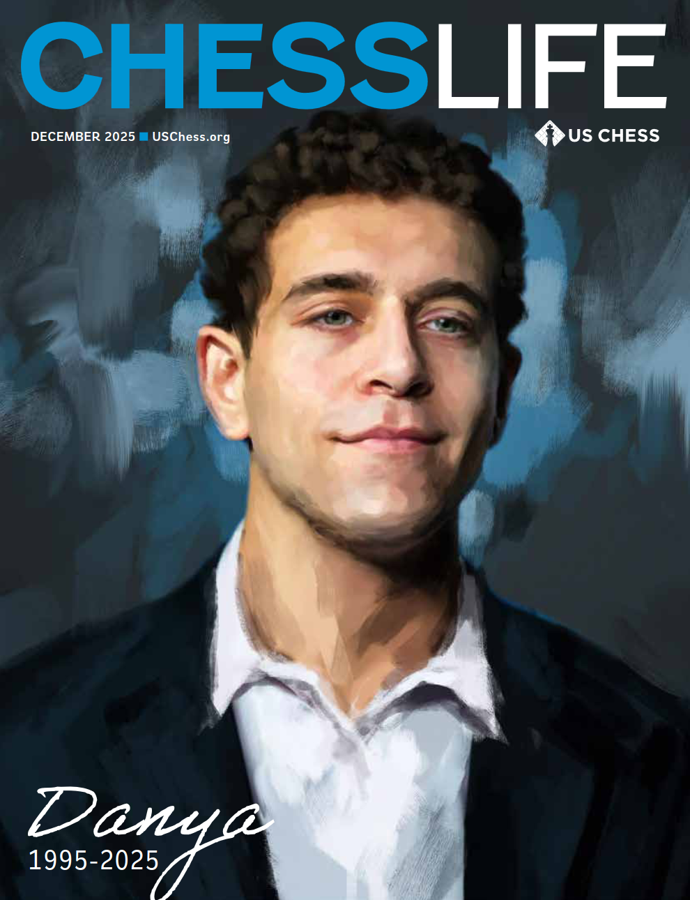

# Rest easy, King.

*Cover: Chess Life, December 2025, US Chess. [Publisher source and caption](./Links/README.md#l004).*

---

## In memory of GM Daniel “Danya” Naroditsky (1995–2025)

Daniel “Danya” Naroditsky was a grandmaster, author, commentator, coach, streamer, and one of the clearest teachers chess has known. He had a rare gift: he could explain a difficult position in plain language without taking away its beauty. His lessons joined calculation and strategy with humor, curiosity, humility, and genuine care for the person trying to learn.

For many people, Danya was more than a strong player on a screen. His articles, books, speedruns, broadcasts, and late-night streams made chess feel welcoming and alive. He showed that excellence and kindness could share the same board, and that teaching was not merely the transfer of knowledge but an act of generosity.

This repository is a small, noncommercial tribute. It gathers publicly available instructional material and organized links so that more players can find his work, study it, and remember the person behind it.

**Rest easy, King. Your words, games, warmth, and love of chess continue to teach.**

## Read his writing offline: PDFs

The [PDF library](./PDF_LIBRARY.md) is the home for locally preserved publications. These files remain readable if their source links disappear.

| Saved publication | Local copy |
| --- | --- |
| The Practical Endgame: 70 columns by Danya | [Read the 140-page collection](./The_Practical_Endgame_2014-2020.pdf) · [Column index](./PRACTICAL_ENDGAME_INDEX.md) |
| Mastering Positional Chess, revised 2026 edition | [25-page publisher sample](./9313.pdf) |
| Mastering Complex Endgames, revised 2026 edition | [15-page publisher sample](./9315.pdf) |
| Mastering Practical Endgames, posthumous 2026 collection | [18-page publisher sample](./9317.pdf) |

The three book files are **samples, not complete books**. Later forewords and editorial revisions are credited separately in [Sources and verification](./SOURCES_AND_VERIFICATION.md#books-and-editions).

### Memorial and other contributors

[US Chess's December 2025 memorial PDF](./PDFs/US_Chess_Danya_Memorial_2025.pdf) is also saved locally. It includes other writers' recollections and annotations, with their original credits preserved.

## Online resources: links may change or disappear

All human-readable external resource links are collected in the [online resources area](./Links/README.md), alongside the [Chess.com catalog instructions](./Links/USING_THE_CATALOG.md).

**An online link is not a preserved copy.** Hosts can change addresses, remove material, or change access requirements. The combined checks cover 162 distinct web destinations: 161 returned HTTP 200, and one older interview blocked the direct automated check but was readable through the web reader. No removed page was confirmed; playback remains unverified for 29 YouTube destinations. See the [September 4, 2026 link report](./Links/LINK_CHECK_REPORT.md).

## Start studying

- [Studying with Danya](./STUDY_GUIDE.md): teachings supported by his own writing, with a suggested way to study them.
- [Additional teachings and PDF sources](./ADDITIONAL_TEACHINGS.md): three forewords, three earlier annotated games, and two further reading sources, with exact credits and reuse status.
- [Official video lessons](./VIDEO_LESSONS.md): his 18-video endgame playlist and further playlists on his own channel.
- [The Practical Endgame index](./PRACTICAL_ENDGAME_INDEX.md): all 70 columns, with issue dates and PDF page links.
- [Study-note template](./STUDY_NOTES_TEMPLATE.md): a place to record your own attempts, mistakes, and lessons.
- [Sources and verification](./SOURCES_AND_VERIFICATION.md): what was checked on September 4, 2026, and what remains uncertain.
- [Contributing](./CONTRIBUTING.md): how to add material with careful attribution.

These study guides and indexes are editorial additions to this independent tribute. They are not a curriculum authored or approved by Danya or his family.

## Rights and attribution

All rights to the original books, articles, columns, videos, broadcasts, photographs, artwork, and other material belong to their respective authors, publishers, platforms, photographers, and rights holders. This repository is an independent, noncommercial fan tribute and is not affiliated with or endorsed by Chess.com, US Chess, New In Chess, YouTube, or Daniel Naroditsky’s family.

The archive ZIP is intended to help people discover and navigate official sources. It does not reproduce the Chess.com articles or videos. Please support official publications and original hosts whenever possible. Rights holders may request a correction or removal by opening an issue in this repository.
